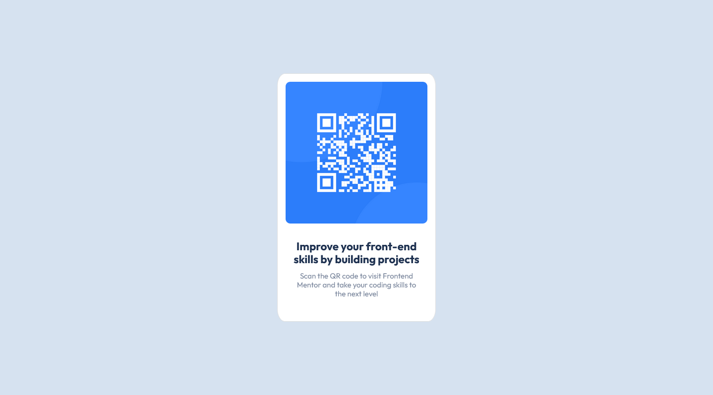

# Frontend Mentor - QR code component solution

This is a solution to the [QR code component challenge on Frontend Mentor](https://www.frontendmentor.io/challenges/qr-code-component-iux_sIO_H). Frontend Mentor challenges help you improve your coding skills by building realistic projects.

## Table of contents

- [Overview](#overview)
  - [Screenshot](#screenshot)
  - [Links](#links)
- [My process](#my-process)
  - [Built with](#built-with)
  - [What I learned](#what-i-learned)
  - [Continued development](#continued-development)
  - [Useful resources](#useful-resources)
- [Author](#author)
- [Acknowledgments](#acknowledgments)

## Overview

### Screenshot



### Links

- Solution URL: [https://mays21.github.io/qr-code-component/](https://mays21.github.io/qr-code-component/)

## My process

### Built with

- Semantic HTML5 markup
- CSS custom properties
- Bootstrap 5
- flex-box

### What I learned

- about landmaks
- card structure
  card > card-img , card-body > card-title, card-text
- border-radius
- center layout

```css
body {
  display: flex;
  justify-content: center;
  align-items: center;
  height: 100vh;
}
```

### Continued development

- Keep trying
- How to use Bootstrap
- How to use JavaScript

### Useful resources

- [Cards - Bootstrap v5.0](https://getbootstrap.jp/docs/5.0/components/card/)
- [Are you using the right CSS units?](https://www.youtube.com/watch?v=N5wpD9Ov_To)

## Author

- Frontend Mentor - [@mays21](https://www.frontendmentor.io/profile/mays21)

## Acknowledgments

- CSS 画像の border-radius は直接 img タグに設定すること
- CSS カードの中央寄せは mx-auto を指定する
- CSS カードの上下中央寄せは 親要素に dispaly:flex;を使うこと

## Got feedback for us?

I love receiving feedback! I'm always looking to improve my challenges. So if you have anything you'd like to mention, please leave a comment.

**Happy programing!**
